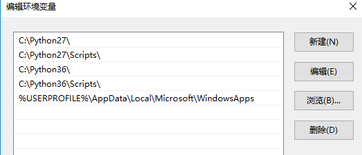
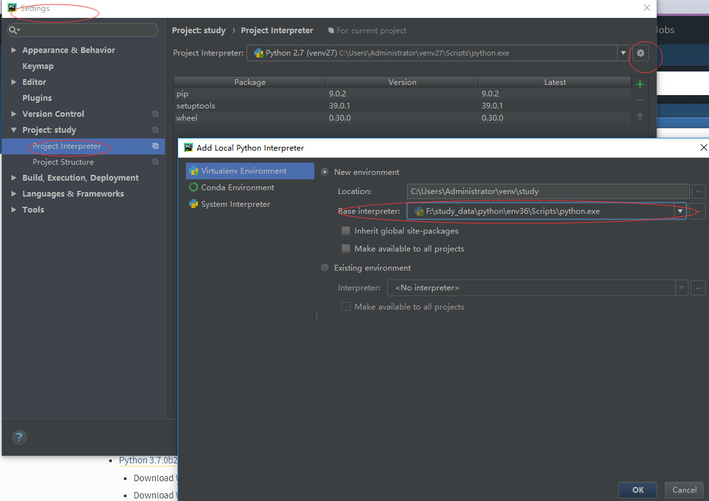
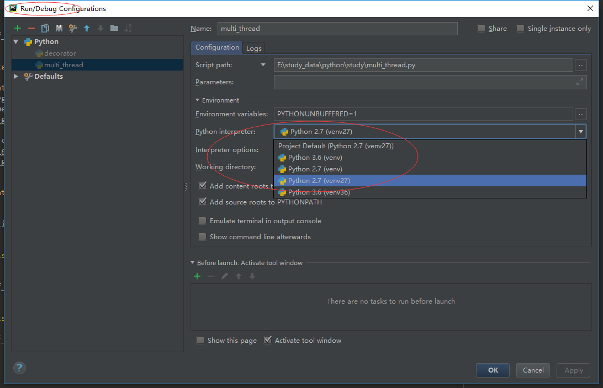

# 多python版本环境搭建
## linux 多python版本搭建
### 工具和配置
```
ubuntu 16.04
git
pyenv
virtualenv
```
### 搭建过程
1. #### 打开pyenv的github代码仓，阅读readme说明，根据readme说明下载安装[pyenv](https://github.com/pyenv/pyenv)
    > There are two ways to install pyenv. The PyPi support is not tested by many users yet, so the direct way is still 
    recommended if you want to play it safe.
    
    Github安装
    
    1. 下载并安装pyenv
        > Github way (recommended)
        > Install: 
        > ```
        > $ curl -L https://github.com/pyenv/pyenv-installer/raw/master/bin/pyenv-installer | bash
        > ```
    2. 根据安装提示将环境变量添加到系统中
        >Define environment variable PYENV_ROOT to point to the path where pyenv repo is cloned and add $PYENV_ROOT/bin 
        to your $PATH for access to the pyenv command-line utility.
        >```
        > $ echo 'export PYENV_ROOT="$HOME/.pyenv"' >> ~/.bash_profile
        > $ echo 'export PATH="$PYENV_ROOT/bin:$PATH"' >> ~/.bash_profile
        >```
        *pyenv 的安装在[pyenv](https://github.com/pyenv/pyenv)说明的`Installation`中说明了添加环境变量，而
        [pyenv-installer](https://github.com/pyenv/pyenv-installer)的快速安装说明中没有说明添加环境变量*
        
    3. 重启shell或者运行.bash_profile文件
        > Restart your shell so the path changes take effect. You can now begin using pyenv.
        > ```
        > $ exec "$SHELL"
        > ```
        > ```
        > $ . ~/.bash_profile
        > ```
    4. 使用pyenv安装多版本python
        > Install Python versions into $(pyenv root)/versions. For example, to download and install Python 2.7.8, run:
        > ```
        > $ pyenv install 2.7.8
        > ```
        *`pyenv install -l`可以查看已支持安装版本，其中包括主流python版本和一些非主流版本，在线安装 是个漫长的过程，耐心等待就好。*
        新版本python安装在`pyenv`目录下的`versions`中
    5. 基于文件夹设置不同的python环境
        ```
        dandelion@ubuntu:~$ mkdir test_2.7
        dandelion@ubuntu:~$ cd test_2.7/
        dandelion@ubuntu:~/test_2.7$ python -V
        Python 2.7.12
        dandelion@ubuntu:~/test_2.7$ pyenv local system 
        dandelion@ubuntu:~/test_2.7$ python -V 
        Python 2.7.12
        dandelion@ubuntu:~/test_2.7$ pyenv version
        system (set by /home/dandelion/test_2.7/.python-version)
        dandelion@ubuntu:~/test_2.7$ 
        dandelion@ubuntu:~/test_2.7$ cd ..
        dandelion@ubuntu:~$ mkdir test3.6
        dandelion@ubuntu:~$ cd test3.6/
        dandelion@ubuntu:~/test3.6$ pyenv version
        system (set by /home/dandelion/.pyenv/version)
        dandelion@ubuntu:~/test3.6$ python -V
        Python 2.7.12
        dandelion@ubuntu:~/test3.6$ pyenv versions 
        * system (set by /home/dandelion/.pyenv/version)
          2.7.12
          2.7.12/envs/env27
          3.6.2
          3.6.2/envs/env36
          env27
          env36
        dandelion@ubuntu:~/test3.6$ pyenv local 3.6.2
        dandelion@ubuntu:~/test3.6$ python -V 
        Python 3.6.2
        dandelion@ubuntu:~/test3.6$ pyenv version 
        3.6.2 (set by /home/dandelion/test3.6/.python-version)
        ```
        `pyenv version`查看当前目录的`pyenv`环境版本
        
        `pyenv versions`查看`pyenv`环境已安装支持的python版本
        
        `pyenv local new-version`设置当前文件夹及其子文件夹的`pyenv`环境版本，这里`new-version`为版本号。system为默认版本。
        修改文件夹版本号后使用`python -V`或者`pyenv version`查看生效版本
        
    PiP安装
    > WARNING still a very hacky proof of concept. Does not work with Python 3 at all yet and in Python 2 only with the
     use of the --egg parameter.
    > Install:
    >```
    > $ pip install --egg pyenv
    >```

2. #### 打开virtualenv的github代码仓，阅读readme说明，根据要求下载安装[virtualenv](https://github.com/pyenv/pyenv-virtualenv)
    
    Github安装
    
    1. 下载pyenv-virtualenv代码仓
        > Check out pyenv-virtualenv into plugin directory
        > ```
        > $ git clone https://github.com/pyenv/pyenv-virtualenv.git $(pyenv root)/plugins/pyenv-virtualenv
        > ```    
        *这里使用了环境变量作为路径，将`pyenv-virtualenv`下载到`pyenv`的`plugins`插件目录中，如果前面没有配置环境变量会导致下载
        失败*
    2. 配置环境变量
        > (OPTIONAL) Add pyenv virtualenv-init to your shell to enable auto-activation of virtualenvs. This is entirely
         optional but pretty useful. See "Activate virtualenv" below.
        > ```
        > $ echo 'eval "$(pyenv virtualenv-init -)"' >> ~/.bash_profile
        > ```
        
    3. 重启shell或者运行.bash_profile文件
        > Restart your shell so the path changes take effect. You can now begin using pyenv.
        > ```
        > $ exec "$SHELL"
        > ```
        > ```
        > $ . ~/.bash_profile
        > ```                 
    4. 使用`pyenv`安装`pyenv virtualenv`虚拟环境
        > To create a virtualenv for the Python version used with pyenv, run pyenv virtualenv, specifying the Python 
        version you want and the name of the virtualenv directory. For example,
        > ```buildoutcfg
        > $ pyenv virtualenv 2.7.10 my-virtual-env-2.7.10
        > ```
        > If there is only one argument given to pyenv virtualenv, the virtualenv will be created with the given name 
        based on the current pyenv Python version.
        > ```
        > $ pyenv version
        > 3.4.3 (set by /home/yyuu/.pyenv/version)
        > $ pyenv virtualenv venv34
        > ```
        *同样，使用`pyenv virtualenv`安装的虚拟环境也是在`pyenv`目录下的`versions`中，使用`pyenv versions`查看版本时可以查到
        创建的虚拟环境*
    5. 将文件夹配置为虚拟环境
        ```
        dandelion@ubuntu:~/test3.6$ pyenv versions
          system
          2.7.12
          2.7.12/envs/env27
        * 3.6.2 (set by /home/dandelion/test3.6/.python-version)
          3.6.2/envs/env36
          env27
          env36
        dandelion@ubuntu:~/test3.6$ pyenv local env36 
        (env36) dandelion@ubuntu:~/test3.6$ 
        (env36) dandelion@ubuntu:~/test3.6$ pyenv version
        env36 (set by /home/dandelion/test3.6/.python-version)
        (env36) dandelion@ubuntu:~/test3.6$        
        (env36) dandelion@ubuntu:~/test3.6$ python -V
        Python 3.6.2  
        ```
        *当文件夹配置了虚拟环境后，只要进入到虚拟环境就会自动启动虚拟环境，离开后退出虚拟环境*
     6. 在虚拟环境中安装软件/库
        ```
        dandelion@ubuntu:~/.pyenv/versions/env27/bin$ cd ~/test3.6/
        (env36) dandelion@ubuntu:~/test3.6$ pip install pygame
        Collecting pygame
          Downloading pygame-1.9.3-cp36-cp36m-manylinux1_x86_64.whl (9.4MB)
            100% |████████████████████████████████| 9.4MB 115kB/s 
        Installing collected packages: pygame
        Successfully installed pygame-1.9.3
        env36) dandelion@ubuntu:~/test3.6$ python 
        Python 3.6.2 (default, Mar 19 2018, 22:03:05) 
        [GCC 5.4.0 20160609] on linux
        Type "help", "copyright", "credits" or "license" for more information.
        >>> import pygame
        >>> exit()
        (env36) dandelion@ubuntu:~/test3.6$ cd ../test_2.7/
        (env27) dandelion@ubuntu:~/test_2.7$ python 
        Python 2.7.12 (default, Mar 19 2018, 22:29:42) 
        [GCC 5.4.0 20160609] on linux2
        Type "help", "copyright", "credits" or "license" for more information.
        >>> import pygame
        Traceback (most recent call last):
          File "<stdin>", line 1, in <module>
        ImportError: No module named pygame
        ```
        *在一个虚拟环境中安装的软件/库不会影响到另一个虚拟环境*
## windows 多python版本搭建
###配置
```
windows 10
virtualenv
python 2.7.12
python 3.6.2
pycharm
```
###搭建过程
1. #### 从[python官网](https://www.python.org/downloads/windows/)下载需要的多个python版本并在windows下安装
2. #### 配置好环境变量
    
    
    哪个版本的环境变量在前面，谁的就生效，因为系统查找时是按从左到右查找的
3. #### 使用`pip`安装`virtualenv`
    ```
    F:\study_data\python\env27\Scripts>pip install virtualenv
    Collecting virtualenv
      Using cached virtualenv-15.1.0-py2.py3-none-any.whl
    Installing collected packages: virtualenv
    Successfully installed virtualenv-15.1.0    
    ```
4. #### 使用`virtualenv`安装基于不同版本`python`的虚拟环境
    ```
    F:\study_data\python>virtualenv -p C:\Python27\python.exe env27
    Running virtualenv with interpreter C:\Python27\python.exe
    New python executable in F:\study_data\python\env27\Scripts\python.exe
    Installing setuptools, pip, wheel...done.
    
    F:\study_data\python>virtualenv -p C:\Python36\python.exe env36
    Running virtualenv with interpreter C:\Python36\python.exe
    Using base prefix 'C:\\Python36'
    New python executable in F:\study_data\python\env36\Scripts\python.exe
    Installing setuptools, pip, wheel...done.
    ```
    
    ```
    F:\study_data\python\env27\Scripts>
    F:\study_data\python\env27\Scripts>activate    
    (env27) F:\study_data\python\env27\Scripts>python -V
    Python 2.7.14
    
    (env27) F:\study_data\python\env27\Scripts>deactivate.bat
    F:\study_data\python\env27\Scripts>cd ../../
    
    F:\study_data\python>cd env36\Scripts
    
    F:\study_data\python\env36\Scripts>activate
    
    (env36) F:\study_data\python\env36\Scripts>python -V
    Python 3.6.1

    ```
    `virtualenv`可以使用`-p`参数制定python版本
5. #### 在`pycharm`中进行多`python`环境配置
    
    可以基于项目配置，也可关闭项目后基于全局配置，这样新建项目时就不用重新配置虚拟环境了。
    
    
    运行和调试时可以选择想要的虚拟环境进行调试。
    如果在运行/调试下配置`edit configuration`会导致项目目录中添加虚拟环境文件，所以一定要先配置虚拟环境再进行运行/调试配置
